# Intro to Yolo
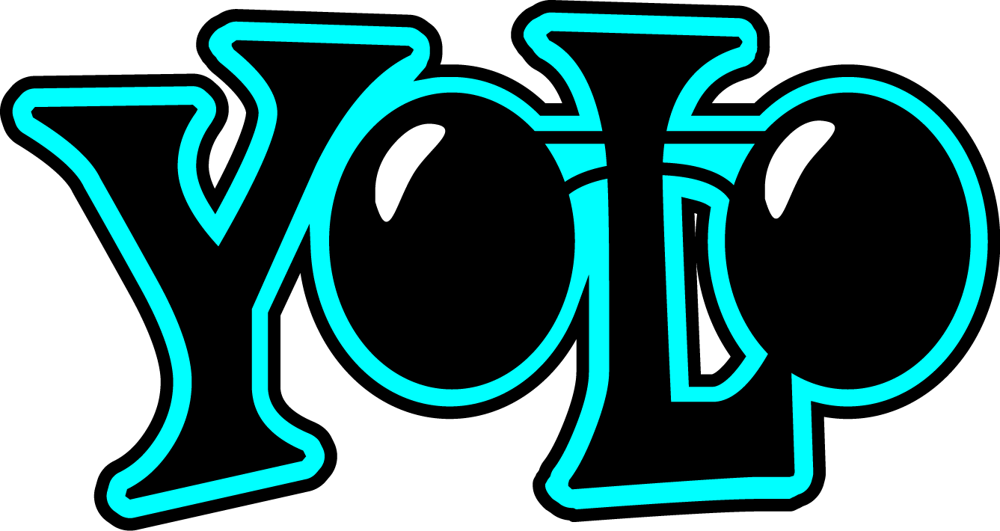</br>
In this repository, I aim at providing theoretical and practical notes for fully understanding `Yolo` models. Then, I 
show how to label a dataset which is downloaded from [kaggle.com](https://www.kaggle.com) 
using [makesense.ai](https://www.makesense.ai/) to make it ready for training by `yolo` models. 
In addition, I have prepared a series of YouTube videos to make the process of learning and training a custom dataset as 
smooth and easy as possible. You can find the YouTube videos in the following playlist:</br>
[Intro_to_Yolo YouTube videos](https://youtube.com/playlist?list=PL2g_5adpoaeK0G2kGA83nDlwplC8Uc0Ce)


## Table of contents
* [Downloading dataset](#Downloading-dataset)
* [Labeling Dataset](#Labeling-Dataset)
* [Training a model with Yolov5](#training-a-model-with-yolov5)


### Downloading dataset
The dataset is available on [kaggle.com](https://www.kaggle.com) in the following link:</br>
[Car License Plate Detection](https://www.kaggle.com/datasets/andrewmvd/car-plate-detection?resource=download)</br>
By clicking on the download link the download begins. 


Note: It may ask you to log in with your kaggle account, the simplest way is to log in with one the third-parties likes Google Account.

### Labeling dataset
For labeling this dataset, I use [makesense.ai](https://www.makesense.ai/). It's a handy and easy-to-begin system for 
labeling different image-based datasets. To better understand how to use makesense, I recorded a video which you
can find in the following link:</br>
[Makesense.ai YouTube video]()

First step: Open [makesense.ai main page](https://www.makesense.ai/)</br>
second step: click`Get Started`  Then Select images by dropping or from your folder and choice . <br />
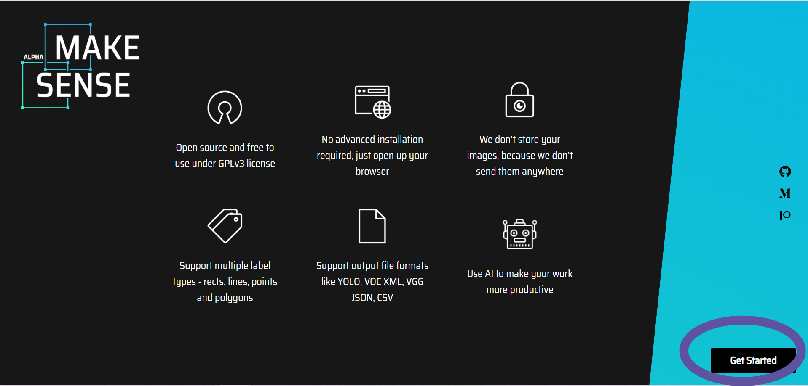</br>
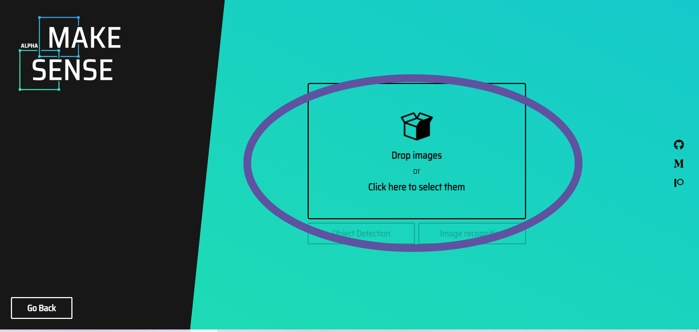</br>
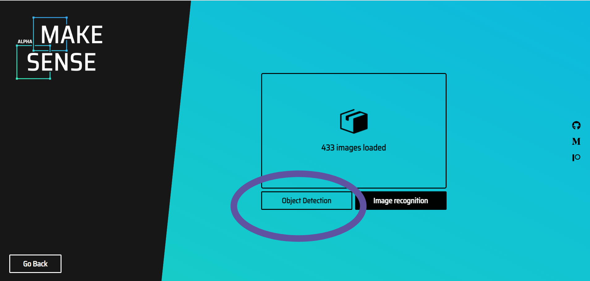</br>

Third step: Before starting, you must choose a name for your label (you can have two or more labels and add a new chosen name by pressing the enter button).<br />
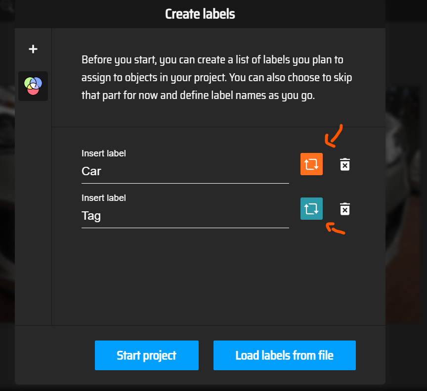</br>

Fourth step: Based on the type of labeling, choose the mode you want (for example, we have chosen Rect) and then drag the label you want on the image.<br />
</br>
</br>

Fifth step: Be sure to select a name of your choice after dragging the tag (if there are two tags on the page, both tags must be named).<br />
</br>

Sixth: After completing the labels, we select the Export Annotation option for the output from the action.(You can get any output model you need) <br />
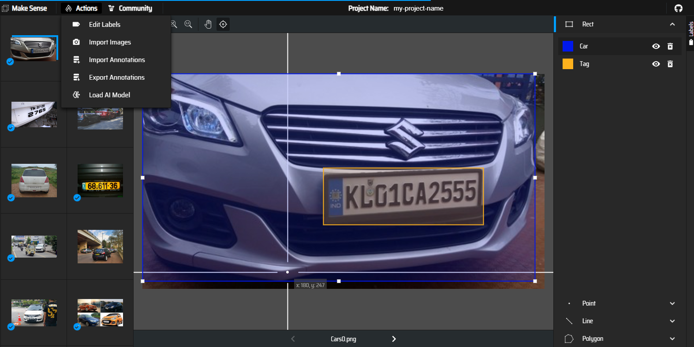</br>
</br>
#### 🤓How to Extract
right-click on the downloaded file and select the extract file option, the labels will be extracted as a file
Last step: Checking the labels
</br>
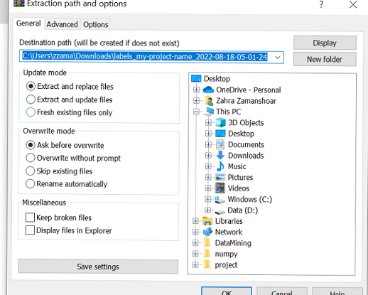</br>
### 💡 Re-labeling or completing incomplete labels
First step: Create a text file named  `labels.txt` in your labels' folder.
Put the names you chose for your label in order (be careful in the order of the names)<br />
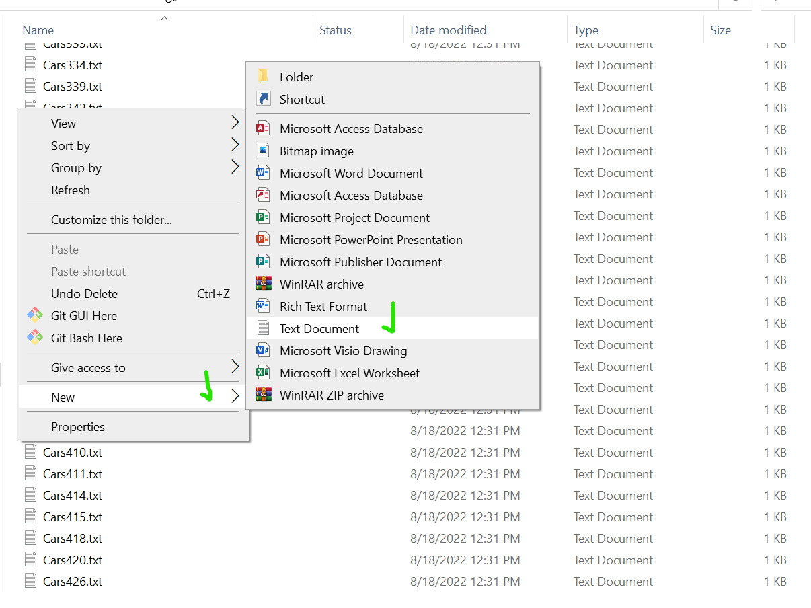</br>
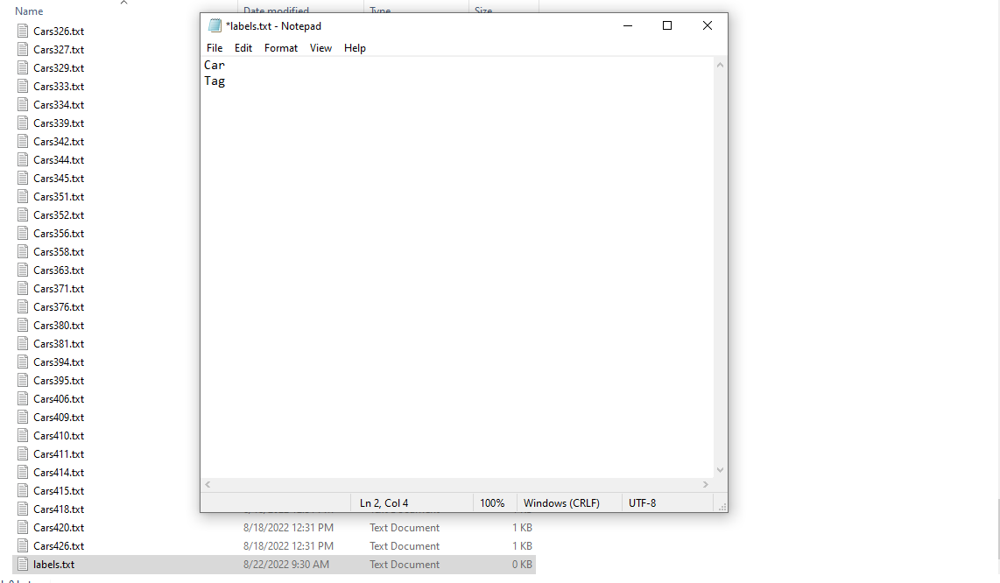</br>
Second step: Reload the photos and instead of selecting the name of the label, select the start project option.<br />
</br>
Third step: Select the import annotation option in Action and drag or select the labels along with the created "labels.txt"
(Make sure that the type of import is the same as the type of export).<br />
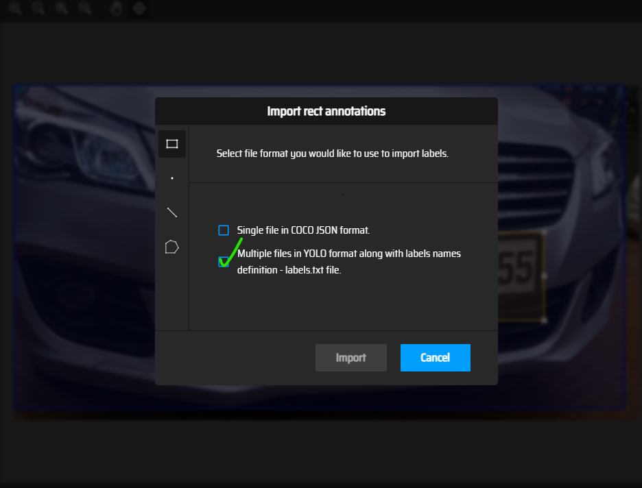</br>
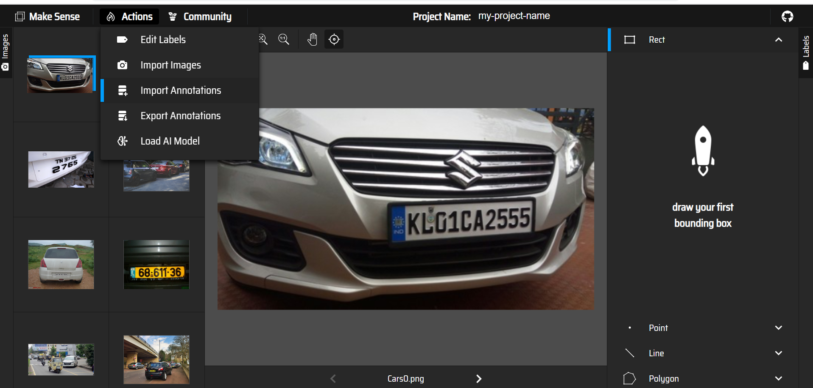</br>
</br>
Congratulations, you can now continue or improve your project :) .</br>
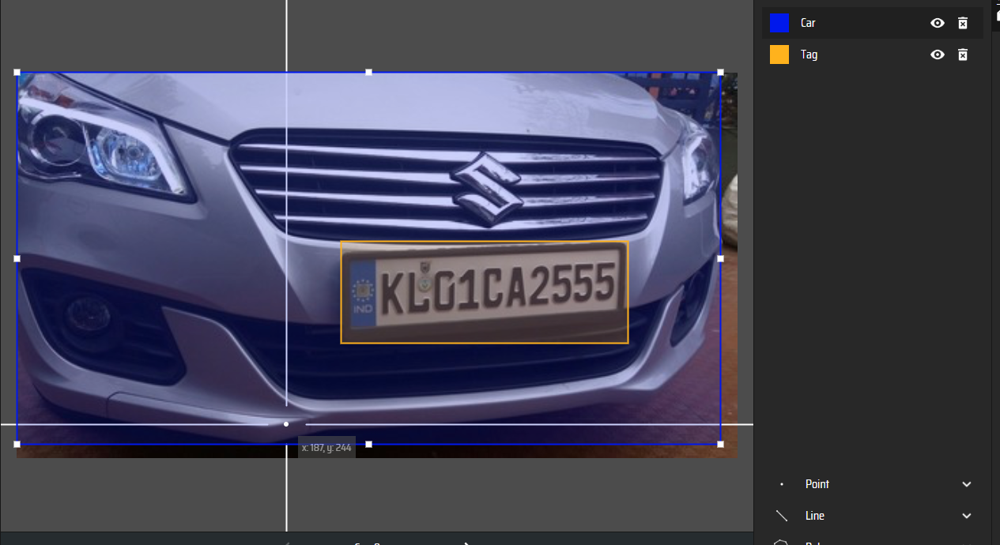</br>
### Training a model with Yolov5

```python
from deep_utils import YOLOV5TorchObjectDetector
YOLOV5TorchObjectDetector.test_label_dir()
```
## 🌟 Spread the word!

I would appreciate it if you could support the active development of this repo by:
- Adding a GitHub Star to the project!
- Following my profile [https://github.com/pooya-mohammadi](https://github.com/pooya-mohammadi) on GitHub
- Following my profile [https://youtube.com/PooyaMohammadiKazaj](https://youtube.com/PooyaMohammadiKazaj) on YouTube

Thank you so much for your interest in growing the reach of the repo!
<p align="right">(<a href="#top">back to top</a>)</p>

## ⚠️ License

Distributed under the MIT License. See `LICENSE` for more information.

<p align="right">(<a href="#top">back to top</a>)</p>


## References:
🍀 deep_utils: [https://github.com/pooya-mohammadi/deep_utils](https://github.com/pooya-mohammadi/deep_utils)</p>
🍀 yolov5: [https://github.com/pooya-mohammadi/yolov5-gradcam](https://github.com/pooya-mohammadi/yolov5-gradcam)</p>
🍀 makesense: [https://www.makesense.ai/](https://www.makesense.ai/)</p>